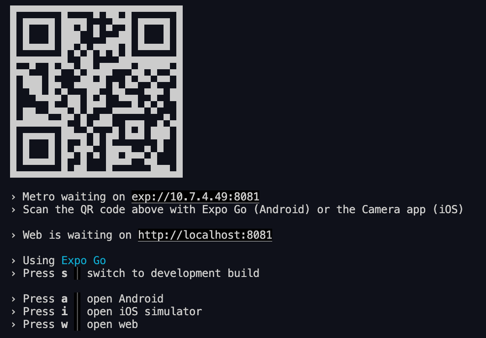

# EAT3D React Native Frontend.

# Usage guide:

1. Clone this repository on your local device.
2. `npm install` in terminal at the root to install dependencies
3. `npx expo start --clear` to begin the server.
4. The following should display on your terminal:
   

There are two ways to run the mobile application in development:

1. Run the app on your mobile device:

- Install the expo go application on your phone through the app store or play store.
- Ensure that both your computer and mobile device are on the same wifi network.
- Scan the QR code with your mobile device through expo go.

2. Run the app on an android/iOS emulator on your computer.

- Install an android/iOS emulator. I have found that XCode's iOS emulator and Android Studio Emulator both work well. Check the following links for more.
- https://docs.expo.dev/workflow/android-studio-emulator/ for android emulator setup
- https://docs.expo.dev/workflow/ios-simulator/ for iOS emulator setup
- Press `i` or `a` on your terminal depending on which emulator you have available.

# Note on connecting to an EAT3D server runtime

As this is a development build, it is assumed that you have the server runtime running on localhost at port 5500.
The logic for producing the API URL can be found under `utils/api.ts`.
If you need to host on a different port or URL then you will need to make changes to this file.
